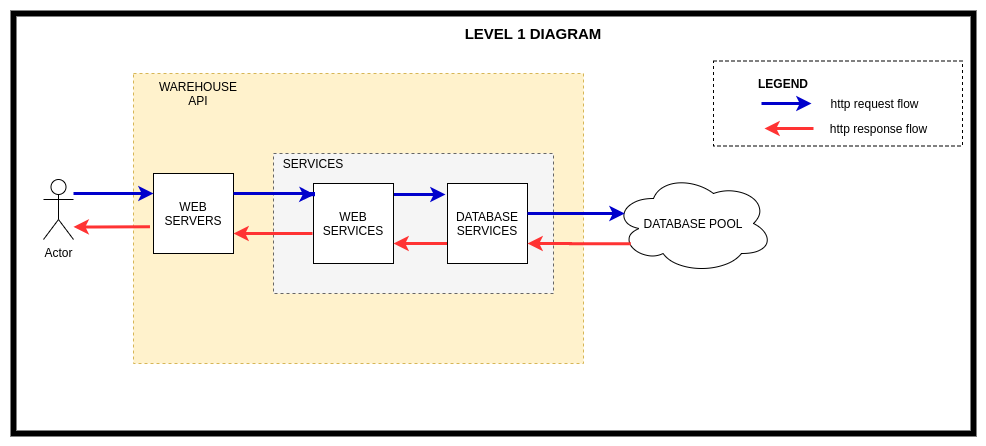
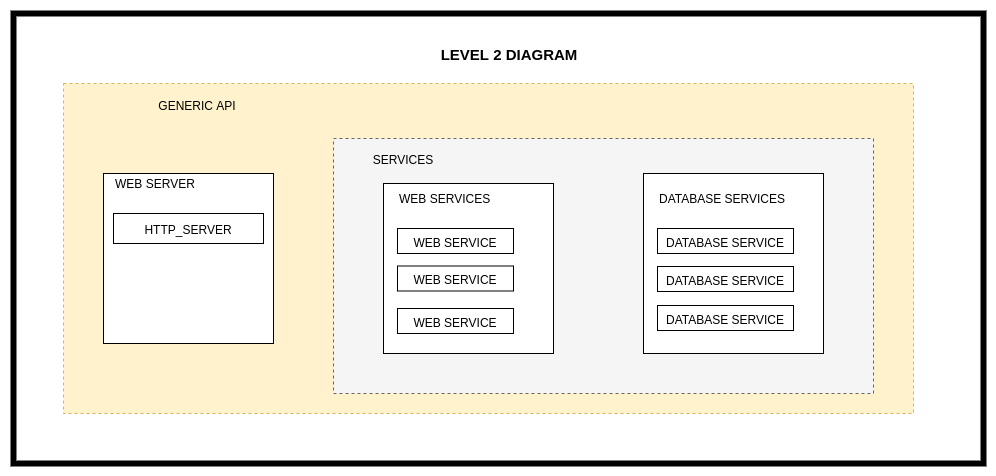
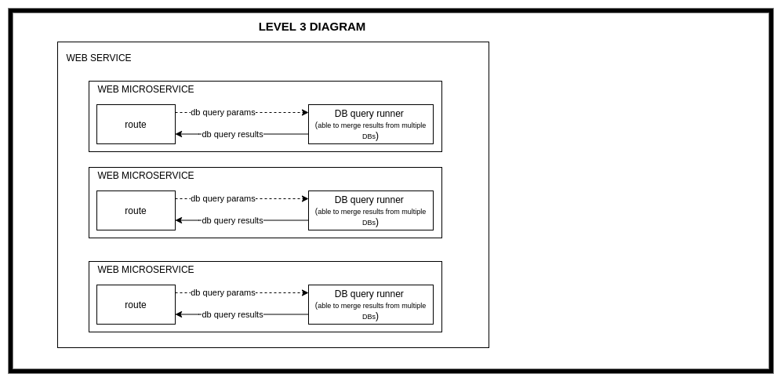

# warehouse_api

This is an integrated API that is meant to provide certain data to the clients as extracted from a range of databases
in a warehouse

## Demos

- [Demo Swagger docs](https://warehouse.sopherapps.com/docs)
- [Demo ReDoc docs](https://warehouse.sopherapps.com/redoc)

## Dependecies

- [FastAPI](https://fastapi.tiangolo.com/) as server
- [uvicorn](www.uvicorn.org) as the server framework to run on
- [SqlAlchemy](https://www.sqlalchemy.org/) for running the database queries

## Design

We are following the service-oriented-architecture (SOA) to make it easier for us to split things up if we ever need to.

The original designs were drawn using [draw.io](https://drive.google.com/file/d/1T_MGu49zsf7bjWeqI8cXAvPBRjrSB4NQ/view?usp=sharing)

### Level 1



### Level 2



### Level 3 [Web service]



## ToDos


## How to run [code samples are for linux]

- Clone the repo

```bash

git clone https://github.com/Tinitto/warehouse_api.git
```

- Enter the root directory and create virtual environment

```bash

cd warehouse_api && python3.7 -m venv env
```

- Install dependencies

```bash

source env/bin/activate && pip install -r requirements.txt
```

- Create the `.env` file and modify the variables in there to what suits you. Be sure to update 
all database URI's to existing postgres database uri

```bash

cp .env.example .env
```

- Run the server

```bash

python main.py
```

- Open the app docs at [http://localhost:5400/docs](http://localhost:5400/docs) for Swagger docs
 or [http://localhost:5400/redoc](http://localhost:5400/redoc) for ReDoc docs. 
 **(the port corresponds to what you have in your .env file)**
 
### How to Run as a systemd service

- Go to the root of your user

```bash

cd ~
```

- Create a projects folder there if non-existent and enter it

```bash
mkdir projects && cd projects
```

- Clone the repo

```bash
git clone https://github.com/Tinitto/warehouse_api.git
```

- Create a virtualenv

```bash
cd warehouse_api && python3.7 -m venv env
```

- Activate the virtual environment and install dependencies

```bash
source env/bin/activate && pip install -r requirements.txt
```

- Copy the `.example.env` file to `.env` and update the variables in there

```bash
cp .example.env .env
```

- Copy the `warehouse_api.service` file to the systemd service folder

```bash
sudo cp warehouse_api.service /etc/systemd/system/warehouse_api.service
```

- Update the `<your_user_name>` placeholder in `/etc/systemd/system/warehouse_api.service` with the name 
of the linux user you are logged in with.

```bash
sudo nano /etc/systemd/system/warehouse_api.service
``` 

- Start the service

```bash
sudo systemctl start warehouse_api.service
```

- Enable the service to start on start up

```bash
sudo systemctl enable warehouse_api
```

- Check the status of the service to see if it is running

```bash
sudo systemctl status warehouse_api
```

- Press `q` to exit

- Open the app docs at [http://localhost:5400/docs](http://localhost:5400/docs) for Swagger docs
 or [http://localhost:5400/redoc](http://localhost:5400/redoc) for ReDoc docs. 
 **(the port corresponds to what you have in your .env file)**


## How to Test

**This application uses snapshot testing for data analytics system back ends as introduced in 
the [data-science-snapshot-testing repo](https://github.com/Tinitto/data-science-snapshot-testing)**
 
- Clone the repo

```bash

git clone https://github.com/Tinitto/warehouse_api.git
```

- Enter the root directory and create virtual environment

```bash

cd warehouse_api && python3.7 -m venv env
```

- Install dependencies

```bash

source env/bin/activate && pip install -r requirements.txt
```

- Create the test database on your local postgreSQL server [You must have installed this already](https://www.postgresql.org/docs/10/tutorial-install.html)

```bash

sudo -su postgres
createdb test_warehouse_api
```

- Change the timezone of the `test_warehouse_api` database to 'UTC'

```bash

psql test_warehouse_api
ALTER DATABASE postgres SET timezone TO 'UTC';
\q
exit
```

- Restart the postgreSQL service to allow the changes to take effect

```bash

sudo systemctl restart postgresql
```

- Run the tests with pytest

```bash

pytest
```

## License

Copyright (c) 2020 [Martin Ahindura](https://github.com/Tinitto) Licensed under the [MIT License](./LICENSE)
